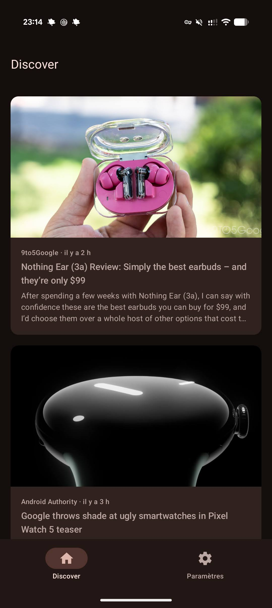

# FreshRSS Discover

Client Android pour un serveur [FreshRSS](https://freshrss.org/) personnel, qui
présente les articles à la manière de **Google Discover** : un flux vertical
unique, mélangé, sans fin apparente.

Pas de liste de flux à parcourir, pas de compteur de non-lus à faire descendre.
On fait défiler ; ce qui a été suffisamment vu devient lu.

Deux façons de le parcourir, au choix : la **liste** verticale, ou le
**balayage** — un article en plein écran, que l'on met de côté d'un geste
horizontal comme une carte d'une pile.

<p align="center">
  
</p>

<p align="center"><em>Le flux Discover, alimenté par une instance FreshRSS réelle.</em></p>

> **État : utilisable, et éprouvé sur appareil.** Connexion au serveur, flux et
> pagination, mélange des sources, cache local et purge, détection de lecture et
> file de marquages, rechargement, reprise de la lecture, ouverture des articles,
> écran de réglages et les deux modes de présentation sont en place.
>
> Ce qui reste ouvert est écrit comme tel : le mode Balayage n'a **pas encore
> d'alternative à son geste** (`GOAL-012-T07`) et **ne mémorise pas la position
> de lecture** (`GOAL-012-T05`). [TASKS.md](./TASKS.md) donne l'avancement tâche
> par tâche, [ARCHITECTURE.md §9](./ARCHITECTURE.md) l'état réel du dépôt.

---

## Ce que fait l'application

- connexion à un serveur FreshRSS via son API compatible Google Reader ;
- flux unique, tous abonnements mélangés, pagination sans fin apparente ;
- **deux modes de présentation** au choix, liste ou balayage, sur le même flux
  et dans le même ordre ;
- marquage automatique comme lu selon la visibilité réelle d'un article, avec
  seuils réglables ;
- synchronisation du statut lu avec le serveur, y compris après une coupure, et
  transmission forcée au passage en arrière-plan ;
- rechargement du flux : tirer en mode Liste, bouton dans les deux modes ;
- reprise de la lecture à l'endroit quitté après fermeture de l'application ;
- ouverture de l'article d'origine dans le navigateur ;
- cache local consultable hors ligne, avec purge automatique et manuelle ;
- interface Material 3, thèmes clair et sombre.

La spécification complète est dans [SPECS.md](./SPECS.md).

## Ce qu'elle ne fera pas

Gestion des abonnements, comptes multiples, widgets, notifications, partage
social, synchronisation en arrière-plan. Voir [SPECS.md §2](./SPECS.md).

---

## Prérequis

- Un serveur **FreshRSS** dont l'**API est activée**
  (*Administration → Authentification → Autoriser l'accès par API*).
- Un **mot de passe API**, distinct du mot de passe de connexion
  (*Profil → Mot de passe API*). C'est la principale cause d'échec de connexion.
- **Android 8.0** (API 26) ou supérieur.

---

## Construire

Le projet se construit avec le JDK embarqué d'Android Studio.

```bash
export JAVA_HOME=$HOME/.local/share/JetBrains/Toolbox/apps/android-studio/jbr
export ANDROID_HOME=$HOME/Android/Sdk

./gradlew assembleDebug
```

Vérification complète, à passer avant tout commit :

```bash
./gradlew ktlintCheck detekt lint test :domain:koverVerify assembleDebug
```

Rendu visuel (hors CI, plusieurs minutes) :

```bash
./gradlew :app:verifyRoborazziDebug   # comparer aux références
./gradlew :app:recordRoborazziDebug   # réenregistrer un changement voulu
```

Installer sur un appareil connecté :

```bash
./gradlew :app:installDebug
```

### Version

Elle n'est **pas écrite dans le dépôt** : `versionName` et `versionCode` sont
tous deux dérivés de l'étiquette Git, pour qu'ils ne puissent pas diverger.

| Ce qui est construit | `versionName` | `versionCode` |
|---|---|---|
| l'étiquette `v1.2.13` | `1.2.13` | `1002013` |
| trois commits après elle | `1.2.13-3-gabc1234` | `1002013` |
| sans étiquette ni `git` | `0.0.0-inconnue` | `1` |

Le nom dit donc de lui-même si la construction est publiable, ce qu'une capture
d'écran de rapport de bogue suffit à lire. La variable `RELEASE_VERSION` prend
le pas sur `git describe` — c'est par elle que la CI transmet l'étiquette, son
`checkout` ne rapatriant pas l'historique.

**Publier une version, c'est donc poser une étiquette** : rien d'autre à
modifier.

```bash
git tag -a v1.1.0 -m "…" && git push origin v1.1.0
```

### Construction de production

`assembleRelease` produit un artefact **signé** si quatre variables
d'environnement décrivent un keystore — `RELEASE_KEYSTORE`,
`RELEASE_KEYSTORE_PASSWORD`, `RELEASE_KEY_ALIAS`, `RELEASE_KEY_PASSWORD` — et un
artefact **non signé** sinon, sans échouer : quiconque construit le projet sans
elles doit y parvenir. Rien de tout cela n'est écrit dans le dépôt.

Le workflow `release.yml` fait de même en CI. Il n'est **jamais** déclenché par
un `push` : seulement à la main, ou par une étiquette `v*`.

---

## Structure

```
:domain   Kotlin/JVM pur — les décisions. Le SDK Android n'y est pas.
:app      Android — l'affichage, le stockage, les appels réseau.
```

Le détail est dans [ARCHITECTURE.md](./ARCHITECTURE.md).

---

## Documentation

| Fichier | Contenu |
|---|---|
| [SPECS.md](./SPECS.md) | Ce que l'application doit faire |
| [LICENSE](./LICENSE) | Licence MIT |
| [ARCHITECTURE.md](./ARCHITECTURE.md) | Comment elle est conçue |
| [TASKS.md](./TASKS.md) | Ce qui est fait, en cours, et à faire |
| [AGENTS.md](./AGENTS.md) | Les règles de développement |
| [CONTRIBUTING.md](./CONTRIBUTING.md) | Comment contribuer |
| [docs/freshrss-api.md](./docs/freshrss-api.md) | Relevé de l'API FreshRSS |
| [PROMPT.md](./PROMPT.md) | L'intention initiale, figée |

---

## Développement assisté

Le dépôt est piloté par un **Harness** : le travail est organisé en *Goals*
découpés en tâches, consignés dans [TASKS.md](./TASKS.md). Quatre commandes
Claude Code l'actionnent :

| Commande | Rôle |
|---|---|
| `/status` | Où en est le projet, et ce qui cloche |
| `/goal <objectif>` | Décomposer un objectif en tâches, puis les exécuter |
| `/task [GOAL-00X-TYY]` | Exécuter une tâche précise, ou la prochaine |
| `/verify` | Compiler, tester, et confronter TASKS.md à la réalité |

Un agent arrivant sur le dépôt lance `/status`, puis `/goal` ou `/task`. Il n'a
pas besoin qu'on lui redonne le contexte : il est dans les fichiers.

---

## Vie privée

L'application ne communique qu'avec **le serveur FreshRSS de l'utilisateur**.
Aucune télémétrie, aucun service tiers, aucune publicité. Les seules autres
connexions sortantes sont le chargement des images d'articles et l'ouverture
d'un lien dans le navigateur, l'une et l'autre à l'initiative de l'utilisateur.

---

## Licence

[MIT](./LICENSE) — © 2026 Valentin Brosseau.

---

## Origine

L'ossature technique — architecture, configuration Gradle, outillage de qualité,
conventions — provient de
[`c4software/tailscale-auto-rules`](https://github.com/c4software/tailscale-auto-rules),
dont la logique métier a été retirée.
