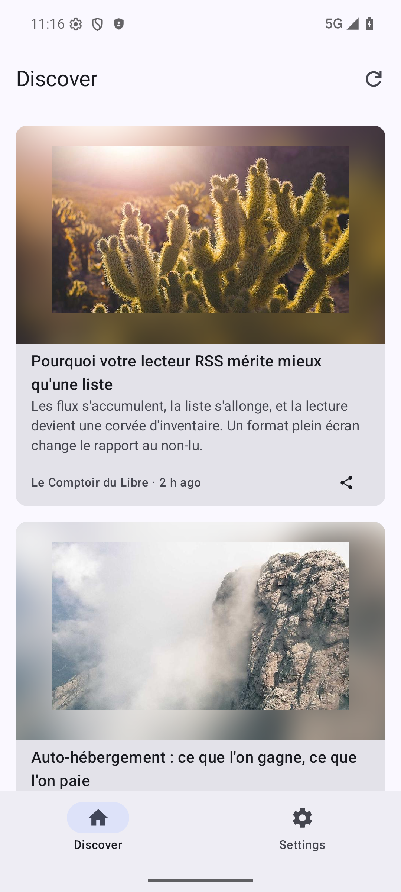

# Serveur de démonstration — accès à l'application (Play Console)

Le champ *Accès à l'application* de la Play Console réclame des identifiants
qui mènent l'examinateur au-delà de l'écran de connexion. L'application étant
un client d'un serveur **personnel**, il n'existe aucun compte à donner : il
faut fournir une instance.

[`worker.js`](./worker.js) en tient lieu. C'est un Worker Cloudflare qui imite
le strict nécessaire de l'API Google Reader de FreshRSS — le chemin nominal
*connexion → affichage du flux*, et rien d'autre — et sert douze articles
fictifs. L'application n'est pas modifiée : elle croit parler à une instance
FreshRSS ordinaire.

---

## Ce qu'il implémente, et ce qu'il n'implémente pas

Les quatre appels du parcours nominal, dans l'ordre où `DefaultAuthRepository`
puis `DefaultArticleRepository` les émettent :

| Route | Réponse | Référence |
|---|---|---|
| `GET /api/greader.php` | `OK`, deux octets | [freshrss-api.md §1.1](../../docs/freshrss-api.md) |
| `GET …/check/compatibility` | `PASS`, ou `FAIL …` sans en-tête `Authorization` | §1.2 |
| `POST …/accounts/ClientLogin` | `SID` / `LSID` / `Auth`, ou `401 Unauthorized!` | §2.1 |
| `GET …/reader/api/0/stream/contents/reading-list` | 12 articles, **sans `continuation`** | §3.4 |

`token` et `edit-tag` (§2.3, §4.1) répondent `404`, **délibérément**. Le
marquage comme lu est optimiste : l'article disparaît de l'écran, la file de
transmission reste pleine et
[`DefaultReadSyncRepository`](../../app/src/main/kotlin/fr/vbrosseau/freshrssdiscover/data/repository/DefaultReadSyncRepository.kt)
traite tout statut autre que `401` en `Deferred` — rien n'est perdu, aucune
erreur ne remonte à l'écran. Vérifié sur l'émulateur, journal à l'appui :

```
D ReadSync: lot de 11 [723712, …, 723722] : Deferred
```

L'absence de `continuation` est du même ordre : c'est le seul signal de fin de
flux, et une page unique de douze articles suffit à un examen. Aucune
pagination à simuler.

---

## Déploiement

[Wrangler](https://developers.cloudflare.com/workers/wrangler/) suffit ; aucun
fichier de configuration n'est nécessaire, le Worker n'a ni liaison, ni
variable, ni stockage.

```bash
npx wrangler login          # une fois : ouvre le navigateur
npx wrangler deploy store/demo-server/worker.js --name freshrss-discover-demo
```

L'URL publiée est affichée en fin de sortie. Elle porte **trois niveaux** —
`<worker>.<sous-domaine-de-compte>.workers.dev` — et non deux :

```
https://freshrss-discover-demo.freshrss-discover-demo.workers.dev
```

> ⚠️ **Le premier déploiement d'un compte laisse quelques minutes sans HTTPS.**
> Cloudflare doit émettre le certificat `*.<sous-domaine>.workers.dev` ;
> jusque-là, le nom résout, le port 80 répond, et le 443 refuse la poignée de
> main (`SSL alert 40, handshake_failure`). Constaté à la première mise en
> ligne. Il n'y a rien à corriger, seulement à attendre — et surtout pas à se
> rabattre sur `http://` pour l'examen : l'écran de connexion signale alors une
> liaison non chiffrée (SPECS.md §3.1), ce qui est une mauvaise entrée en
> matière pour un examinateur.

Vérification, une fois le certificat émis :

```bash
B=https://freshrss-discover-demo.freshrss-discover-demo.workers.dev/api/greader.php
curl -s "$B"                                              # OK
curl -s -X POST -d 'Email=demo&Passwd=demo' "$B/accounts/ClientLogin"
curl -s -H 'Authorization: GoogleLogin auth=demo/demo0000000000000000000000000000000' \
     "$B/reader/api/0/stream/contents/reading-list?n=40" | head -c 200
```

Le Worker reste en ligne sans entretien, et **doit y rester** : Google s'en
sert à chaque mise à jour, pas seulement à la première soumission.

---

## Ce qu'il faut coller dans la Play Console

Champ *Accès à l'application* → « Toutes les fonctionnalités sont accessibles
avec des identifiants » :

| Champ | Valeur |
|---|---|
| Nom d'utilisateur | `demo` |
| Mot de passe | `demo` |

Les instructions se saisissent dans la **langue par défaut de la fiche**, donc
en anglais : [`app-access-en.txt`](./app-access-en.txt), prêt à coller (682
caractères). Traduction de travail, pour relecture :

> L'application est un client pour FreshRSS, un agrégateur RSS auto-hébergé.
> Chaque utilisateur se connecte à son propre serveur ; l'adresse ci-dessous
> est une instance de démonstration fournie pour l'examen.
>
> 1. Adresse du serveur :
>    `https://freshrss-discover-demo.freshrss-discover-demo.workers.dev`
> 2. Identifiant : `demo`
> 3. Mot de passe d'API : `demo`
>
> Le troisième champ est le **mot de passe d'API** de FreshRSS, distinct du mot
> de passe de connexion au site : c'est la première cause d'échec de connexion.
> Ici les deux valent `demo`.
>
> Une fois connecté, l'écran Discover affiche le flux : faire défiler
> verticalement. L'onglet Paramètres permet de passer en mode « Immersif », où
> chaque article remplit l'écran et laisse place au suivant d'un geste vers le
> haut.

Les identifiants ne sont pas des secrets : ils n'ouvrent que ce Worker, qui ne
sert que douze articles inventés et n'accepte aucune écriture.

---

## Vérifié sur l'émulateur

Émulateur de [`envTest/`](../../envTest/README.md) — Pixel 6, API 36,
1 080 × 2 400 — `app-debug` installé, application connectée à l'adresse
ci-dessus, le 13 août 2026. Parcours complet : saisie des trois champs,
connexion, flux affiché, défilement sur les douze articles.



Les articles sont fictifs et écrits pour ce fichier ; les illustrations
viennent de `picsum.photos`, tirées au sort mais stables d'une requête à
l'autre. Les dates sont calculées à l'exécution — figées, le flux afficherait
« il y a huit mois » le jour de l'examen.

**Cette capture ne va pas dans la fiche Play.** Les captures de la fiche
montrent des articles réels, servis par une vraie instance
([`../README.md`](../README.md), § *Comment les captures ont été produites*).
Celle-ci n'atteste que du bon fonctionnement du serveur de démonstration.
